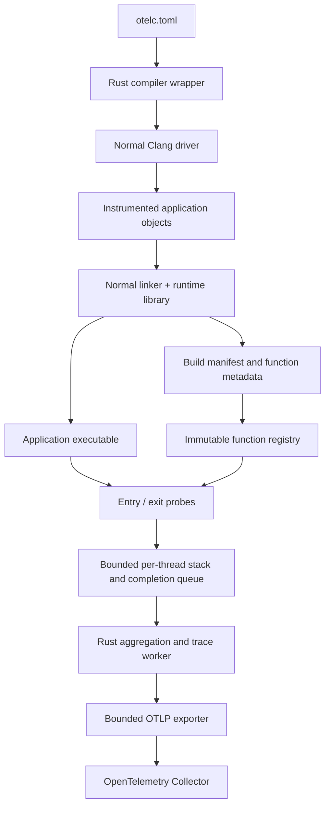

# System design

## Purpose and status

otelc will provide compiler-assisted observability for native applications, starting with C and C++. Developers will select application functions, rebuild through their normal compiler, and send timing metrics and supported traces to an OTLP-compatible Collector. The project belongs to quux and is independent of the OpenTelemetry project.

This document is the initial architecture proposal. Repository validation and SonarQube integration exist; product components are planned. The first implementation must deliver a working vertical slice rather than empty crate scaffolding.

## Goals

- Preserve application source, return values, calling conventions, and observable control flow.
- Make function selection explicit and inspectable before running the application.
- Keep steady-state probes free of heap allocation, locks, symbol resolution, serialization, and network I/O.
- Bound runtime memory, cardinality, export queues, and shutdown time.
- Expose lost observations and unsupported control flow rather than manufacture accurate-looking telemetry.
- Export standard OTLP and integrate with existing Collectors and backends.
- Support macOS ARM64 and Linux x86-64/ARM64 through tested toolchain adapters.

Initial non-goals are instrumenting existing binaries without rebuilding, modifying third-party libraries automatically, recording arguments or return values, interpreting business errors, distributed context propagation without an adapter, asynchronous language semantics, and continuous profiling.

## Architecture

The callback backend uses the existing `__cyg_profile_func_enter` and `__cyg_profile_func_exit` ABI. A later LLVM pass uses [otelc's descriptor/token ABI](abi.md). Both feed the same runtime and telemetry pipeline, but their capabilities are reported separately.

## Components and ownership

| Component | Responsibility | Implementation direction |
| --- | --- | --- |
| Compiler wrapper | Parse configuration; classify compiler invocations; add probes and runtime linkage; preserve compiler results | Rust |
| Configuration library | Validate a versioned TOML schema; compile selection rules; enforce bounds | Rust |
| Symbol and manifest library | Read ELF/Mach-O identities and symbols; demangle names; produce and validate metadata | Rust |
| Probe shim | Native lifecycle hooks, minimal TLS access, legacy callbacks, and a non-unwinding boundary | Small C shim plus Rust |
| Runtime core | Bounded stacks, completion queues, thread ownership, clocks, and loss accounting | Rust |
| Telemetry worker | Metric aggregation, coherent trace construction, metadata lookup, and export scheduling | Rust |
| OTLP exporter | Batch, serialize, send, retry within a bounded budget, and report export loss | Rust OpenTelemetry ecosystem |
| LLVM pass | Select functions at compile time and emit descriptors and correct exit probes | C++, matched to a tested LLVM major |

The product's initial Cargo workspace is intended to contain `quux-otelc-cli`, `quux-otelc-config`, `quux-otelc-symbols`, `quux-otelc-runtime`, and `quux-otelc-export`. Introduce a crate only when it has an implemented boundary. Keep LLVM integration under `compiler/llvm/` and native fixtures under `tests/fixtures/` when those milestones begin. Dependency versions and the Rust minimum supported version will be pinned with the first implementation.

## End-to-end contract

1. Validate configuration and the selected compiler's capabilities before compilation.
2. Instrument only explicitly included application translation units. Leave other compiler invocations untouched.
3. Link the runtime into the final executable and generate a manifest from the final linked binary before stripping.
4. Initialise the runtime with a validated manifest, immutable selection tables, fixed capacity pools, and an exporter worker.
5. On function entry, record a bounded frame; on a valid exit, publish one complete timing record.
6. The worker aggregates received observations and constructs traces only for a backend whose nesting/exit contract is supported.
7. Export in batches. Application threads never wait for the Collector.
8. On normal process exit, attempt a bounded drain. Abrupt termination can lose buffered data.

## Invariants

The application remains the owner of its execution. Runtime startup failure disables telemetry with a bounded diagnostic. Exporter failure changes telemetry counters, never application return values. Runtime code and its dependencies must never be instrumented by the application's probe backend.

Each thread owns its producer stack and queue. A single worker owns queue consumption and metric aggregation. Release/acquire publication is sufficient for queue transfer; no worker reads an uncommitted record. Retired thread slots cannot be reused until their queues have been drained and their generation has changed.

Monotonic time measures duration. Wall time supplies OTLP timestamps through a worker-owned clock anchor. Symbol names and source metadata stay outside the hot path. Integer keys are internal implementation details and do not become unbounded metric labels.

## Selection and accuracy

Translation-unit selection is build-time selection. Function-name selection is runtime admission with the callback backend, so excluded functions can still pay for injected callbacks. The LLVM backend will omit excluded probes entirely. See [instrumentation](instrumentation.md).

The callback milestone supports synchronous normal returns only. Its supported C++ lane requires selected code to be compiled with `-fno-exceptions`; the wrapper must not add that flag to an existing application silently. C `longjmp`, thread cancellation, coroutines, and dynamically unloaded instrumented code are outside that lane.

Metrics count completed records actually received by the worker. They are exact for selected normal-return calls only while admission and completion-loss counters remain zero. No sampling multiplier is used to invent missing observations. See [telemetry semantics](telemetry.md).

## Evolution

The first milestone validates the wrapper/runtime/OTLP boundary using existing compiler callbacks. The next milestone adds an LLVM pass because it provides the control needed for compile-time selection and exceptional exits. Nested traces depend on that capability, not simply on having seen entry and exit events in a happy-path demonstration.

Runtime filter changes, context adapters, more languages, packaging, and profiles follow only after the relevant correctness and overhead evidence in the [roadmap](roadmap.md) is available. The [decision record](decisions.md) captures the reasoning behind this sequence.
