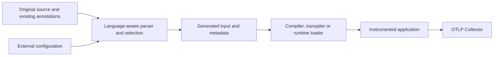
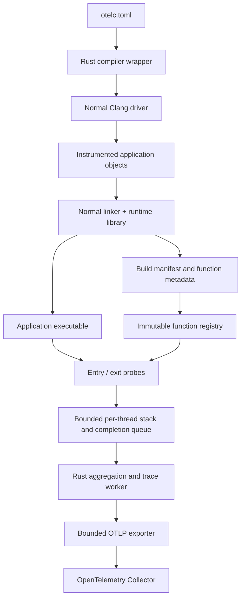

# System design

## Purpose and status

otelc will provide observability without application source edits across C, C++, Rust, TypeScript/JavaScript, Java, Python and Go, starting with compiler-assisted C and C++. Developers will select application functions, activate a language-specific build or launch adapter, and send timing metrics and supported traces to an OTLP-compatible Collector. The project belongs to quux and is independent of the OpenTelemetry project.

This document specifies the architecture. The [local implementation](local-implementation.md) delivers callback and LLVM function timing, including exception-aware C++, plus an opt-in lifetime guard. All target languages now have function timing adapters, and C, Rust, Python, Java, JavaScript, TypeScript and Go have sampled function spans within their documented boundaries. See [C spans](c-spans.md) and [Rust spans](rust-spans.md). Automatic class lifetimes, C++ tracing and live filter updates remain planned. Existing Clang function annotations and an opt-in owner-only LLVM metrics control socket are implemented locally.

## Goals

- Preserve application source, return values, calling conventions, and observable control flow.
- Make function selection explicit and inspectable before running the application.
- Keep native steady-state probes free of heap allocation, locks, symbol resolution, serialization, and network I/O.
- Bound runtime memory, cardinality, export queues, and shutdown time.
- Expose lost observations and unsupported control flow rather than manufacture accurate-looking telemetry.
- Export standard OTLP and integrate with existing Collectors and backends.
- Support macOS ARM64 and Linux x86-64/ARM64 through tested toolchain adapters.

Initial non-goals are instrumenting existing binaries without rebuilding, modifying third-party libraries automatically, recording arguments or return values, interpreting business errors, distributed context propagation without an adapter, asynchronous language semantics, and continuous profiling.

## Source-free instrumentation contract

All target-language adapters must instrument configured application functions and supported object/resource lifetimes without editing application or dependency source files. Selection, export settings and supported lifetime boundaries belong in external configuration. Users may install instrumentation tooling and SDK/runtime packages, rebuild through a wrapper, or change compiler options, environment variables and launch commands. Requiring users to add source imports, annotations, decorators, macro attributes, guard members or manual entry/exit calls does not meet this contract. A processor may inject these automatically into generated input where language and ABI semantics allow. Existing annotations or opt-in metadata may guide processing; external configuration must remain sufficient when none are present.

Transforms may change compiler IR, loaded bytecode, in-memory modules or generated copies in a separate build directory. Original source files must remain byte-for-byte unchanged. A common selection and OTLP configuration is the product interface; each language has its own compiler, loader or agent adapter. Managed-language adapters use their appropriate SDK and task/context model rather than the native runtime's thread-slot ABI.

A language-aware pre-parser is an allowed implementation route: read original source and configuration, build a syntax/semantic model, resolve selection and existing annotations, then emit instrumented copies or compiler input in an isolated build directory. The normal compiler/transpiler consumes that generated input. The processor can inject runtime imports, function entry/exit code or annotations consumed by a downstream pass. Generated code is an instrumentation artefact, not a patch users must apply to their application.

The proposed source-processing path is:

For C/C++, [Clang LibTooling](https://clang.llvm.org/docs/LibTooling.html) provides a basis for a standalone parser using the application's compilation arguments, while [Clang plugins](https://clang.llvm.org/docs/ClangPlugins.html) provide a frontend route for metadata and annotations. The specific injection and lifetime lowering remain implementation work.

Preserve include/module resolution, preprocessing conditions, macro expansion, comments used as metadata, templates, source maps/debug locations and build-cache identity. Use the original compilation arguments and language parser rather than regex substitution. Native tooling may expose generated input through a compiler/VFS adapter so relative includes and original diagnostic locations remain meaningful. The native LLVM pass remains a supported function-timing route; the pre-parser is an additional proposed route for metadata and language-specific injection.

External exclusions always win. Annotations may supply opt-in selection, opt-out or naming hints only after their meaning is declared by the adapter; missing annotations must not prevent external selection. Resolve conflicting metadata visibly, preserve unrelated annotations and detect existing instrumentation to avoid double probes. Parsing failures and constructs whose semantics cannot be preserved must produce inspectable diagnostics.

The intended coverage includes selected application functions, not only known HTTP/database libraries. Stock OpenTelemetry auto-instrumentation can provide library coverage, but cannot by itself be treated as proof of arbitrary application-function coverage. See the [OpenTelemetry zero-code scope](https://opentelemetry.io/docs/concepts/instrumentation/zero-code/) and the [language adapter TODOs](roadmap.md#todo-language-adapters).

Native C/C++ function timing meets the source-edit requirement locally. The current `ObjectLifetime` guard requires application changes and is an interim opt-in prototype. Automatic C++ class lifetime support may use a language-aware pre-parser with a Clang frontend/code-generation adapter, with construction failure, destructor cleanup, copies/moves, inheritance and storage reuse qualified explicitly. It must also avoid changing the application's class layout or copy/move behaviour.

Lifetime semantics are language-specific. A C++ object lifetime, a Rust value's initialisation/move/drop and a managed resource's close operation cannot share an assumed destructor boundary. Garbage collection is distinct from explicit close/dispose; allocation-to-collection is a separate capability where observable. Adapters must declare their measured boundaries and visibly report unsupported cases instead of substituting a manual source API.

Every adapter is accepted only when an internal fixture's source hashes match before and after instrumentation, selected application functions emit expected telemetry, unselected functions remain excluded, and application results and supported exception/panic/async behaviour match the plain build. The same unchanged fixture must supply plain-versus-instrumented benchmark evidence and loss accounting. Required manual probes fail acceptance even if their telemetry is correct.

## Native architecture

The callback backend uses the existing `__cyg_profile_func_enter` and `__cyg_profile_func_exit` ABI. The local LLVM pass uses an interim address/token interface; the [descriptor/token ABI](abi.md) remains a proposal. Both feed the same runtime and telemetry pipeline, but their capabilities are reported separately.

## Components and ownership

| Component | Responsibility | Implementation direction |
| --- | --- | --- |
| Compiler wrapper | Parse configuration; classify compiler invocations; add probes and runtime linkage; preserve compiler results | Rust |
| Configuration library | Validate a versioned TOML schema; compile selection rules; enforce bounds | Rust |
| Symbol and manifest library | Read ELF/Mach-O identities and symbols; demangle names; produce and validate metadata | Rust |
| Probe shim | Native lifecycle hooks, minimal TLS access, legacy callbacks, and a non-unwinding boundary | Small C shim plus Rust |
| Runtime core | Bounded stacks, completion queues, thread ownership, clocks, and loss accounting | Rust |
| Telemetry worker | Metric aggregation, coherent trace construction, metadata lookup, and export scheduling | Rust |
| OTLP exporter | Batch, serialize, send, retry within a bounded budget, and report export loss | Rust OpenTelemetry ecosystem |
| LLVM pass | Select functions at compile time and emit descriptors and correct exit probes | C++, matched to a tested LLVM major |

The Cargo workspace contains `quux-otelc-cli`, `quux-otelc-config`, `quux-otelc-symbols`, `quux-otelc-runtime`, and `quux-otelc-export`. Introduce a crate only when it has an implemented boundary. Keep LLVM integration under `native/llvm/` and native fixtures under `tests/fixtures/` when those milestones begin. Cargo.lock pins dependencies; the current Rust minimum is 1.98.

## Native end-to-end contract

1. Validate configuration and the selected compiler's capabilities before compilation.
2. Instrument only explicitly included application translation units. Leave other compiler invocations untouched.
3. Link the runtime into the final executable and generate a manifest from the final linked binary before stripping.
4. Initialise the runtime with a validated manifest, immutable selection tables, fixed capacity pools, and an exporter worker.
5. On function entry, record a bounded frame; on a valid exit, publish one complete timing record.
6. The worker aggregates received observations and constructs traces only for a backend whose nesting/exit contract is supported.
7. Export in batches. Application threads never wait for the Collector.
8. On normal process exit, attempt a bounded drain. Abrupt termination can lose buffered data.

## Invariants

The application remains the owner of its execution. Runtime startup failure disables telemetry with a bounded diagnostic. Exporter failure changes telemetry counters, never application return values. Runtime code and its dependencies must never be instrumented by the application's probe backend.

Each thread owns its producer stack and queue. A single worker owns queue consumption and metric aggregation. Release/acquire publication is sufficient for queue transfer; no worker reads an uncommitted record. Retired thread slots cannot be reused until their queues have been drained and their generation has changed.

Monotonic time measures duration. Wall time supplies OTLP timestamps through a worker-owned clock anchor. Symbol names and source metadata stay outside the hot path. Integer keys are internal implementation details and do not become unbounded metric labels.

## Selection and accuracy

Translation-unit selection is build-time selection. Function-name selection is runtime admission with the callback backend, so excluded functions can still pay for injected callbacks. The LLVM backend omits excluded probes entirely. See [instrumentation](instrumentation.md).

The callback milestone supports synchronous normal returns only. Its supported C++ lane requires selected code to be compiled with `-fno-exceptions`; the wrapper must not add that flag to an existing application silently. C `longjmp`, thread cancellation, coroutines, and dynamically unloaded instrumented code are outside that lane.

Metrics count completed records actually received by the worker. They are exact for selected normal-return calls only while admission and completion-loss counters remain zero. No sampling multiplier is used to invent missing observations. See [telemetry semantics](telemetry.md).

## Evolution

The first milestone validates the wrapper/runtime/OTLP boundary using existing compiler callbacks. The next milestone adds an LLVM pass because it provides the control needed for compile-time selection and exceptional exits. Nested traces depend on that capability, not simply on having seen entry and exit events in a happy-path demonstration.

Runtime filter changes, context adapters, more languages, packaging, and profiles follow only after the relevant correctness and overhead evidence in the [roadmap](roadmap.md) is available. The [decision record](decisions.md) captures the reasoning behind this sequence.
