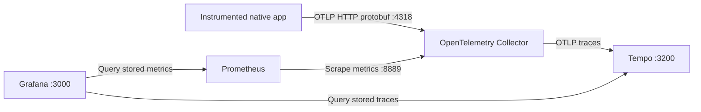

# Local Collector and Grafana

## Purpose and data flow

The Docker Compose stack provides local metrics and trace viewers for internal test apps and benchmarks. Ports bind to `127.0.0.1`; this is a local development setup. Grafana permits anonymous read-only viewing and does not create a default administrator account. Configuration and dashboards are maintained as files.



The Collector receives OTLP metrics, uses a 256 MiB memory limiter, batches exports and exposes Prometheus metrics inside the Docker network. Prometheus scrapes once per second and retains data for seven days. Tempo stores received traces locally with 24-hour retention. Grafana queries Prometheus and Tempo; the Collector itself is not the historical database.

Pinned images are OpenTelemetry Collector `0.162.0`, Prometheus `v3.15.0` and Grafana `13.2.3` and Tempo `2.10.8`. Tempo 2.10 is a [maintained version](https://grafana.com/docs/tempo/latest/set-up-for-tracing/setup-tempo/recommended-versions/); the patch is pinned to the [published release](https://github.com/grafana/tempo/releases/tag/v2.10.8). The local Compose project is named `otelc`. These configuration files are the source of truth:

- [`compose.yaml`](../compose.yaml): services, loopback ports and persistent volumes.
- [`deploy/collector.yaml`](../deploy/collector.yaml): OTLP receiver and metrics/trace pipelines.
- [`deploy/tempo.yaml`](../deploy/tempo.yaml): local trace storage and retention.
- [`deploy/prometheus.yaml`](../deploy/prometheus.yaml): Collector scrape target.
- [`deploy/grafana/provisioning`](../deploy/grafana/provisioning): datasource and dashboard registration, with 30-second polling for VM-shared files.
- [`deploy/grafana/dashboards/otelc.json`](../deploy/grafana/dashboards/otelc.json): metrics dashboard panels and queries.
- [`deploy/grafana/dashboards/otelc-traces.json`](../deploy/grafana/dashboards/otelc-traces.json): read-only trace search and span tree.

## Start and view

Requirements: a running Docker engine and the Docker Compose plugin. Building the examples also requires the Rust and matched LLVM toolchain described in [local setup](local-implementation.md#build-and-run). Run these commands from the repository root. Start your Docker engine first; on the tested Mac this is Colima.

```sh
colima start
docker compose up -d
make examples
./target/debug/quux-otelc --config examples/local.toml run ./build/native/timing threads
./target/debug/quux-otelc --config examples/exceptions.toml run ./build/native/exceptions
./target/debug/quux-otelc --config examples/exceptions.toml run ./build/native/objects
```

Open the [otelc Grafana dashboard](http://localhost:3000/d/otelc-local) or [Prometheus](http://localhost:9090). The datasource and dashboard are provisioned automatically. No login is needed for viewing. Allow a few seconds for Collector batching, scraping and the dashboard refresh.

| Endpoint | Purpose |
| --- | --- |
| `http://127.0.0.1:4318/v1/metrics` | Apps send OTLP/HTTP metric protobuf here |
| `http://127.0.0.1:4318/v1/traces` | Rust sends OTLP/HTTP trace protobuf here |
| `http://localhost:3200/ready` | Tempo readiness |
| `http://localhost:3000/d/otelc-local` | Grafana dashboard |
| `http://localhost:9090` | Prometheus queries and scrape status |
| `collector:8889/metrics` | Internal Docker scrape endpoint, not exposed on the host |

Examples use `http://127.0.0.1:4318` or `http://localhost:4318` as the base endpoint; otelc appends `/v1/metrics`. A signal-specific `OTEL_EXPORTER_OTLP_METRICS_ENDPOINT` must contain the complete path. See [configuration](configuration.md) for precedence and credentials.

## Dashboard meaning

The dashboard shows completed function calls, exceptional function exits, completed object lifetimes, lost observations, function counts, duration p95, object lifetime p95 and losses by reason. Object metrics appear when the app uses the lifetime guard and its class is admitted in `[objects]`. Exception metrics require the LLVM backend; a catch inside a function does not make that function an exceptional exit.

Metric names are translated for Prometheus:

| Prometheus name | Meaning |
| --- | --- |
| `otelc_function_calls_total` | Completed selected invocations, including exceptional exits |
| `otelc_function_unwinds_total` | Selected invocations ending through exception unwinding |
| `otelc_function_cancellations_total` | Rust async observations ending through future cancellation |
| `otelc_function_duration_seconds_bucket` | Inclusive function duration histogram |
| `otelc_object_lifetimes_total` | Completed admitted lifetime guards |
| `otelc_object_lifetime_duration_seconds_bucket` | Duration from guard start to finish |
| `otelc_runtime_dropped_observations_total` | Runtime losses, labelled by `reason` |
| `otelc_export_dropped_batches_total` | Export batches lost or rejected |

The lost-observations panels show runtime losses. Query the separate export-batch counter when diagnosing delivery failures. For example, `sum(otelc_function_calls_total{service_name="otelc-benchmark"})` isolates the benchmark service.

Counts are cumulative within each process instance. `service_instance_id` distinguishes process restarts, and the dashboard sums instances. Short-lived test apps therefore contribute separate series. Histogram p95 is an estimate from the configured buckets, not a recorded percentile for every invocation. Empty panels mean no matching series has been received, rather than proof of zero work.

The Collector retains inactive metric series for one hour; Prometheus retains historical samples for seven days. These choices make short example runs visible. They also mean a count panel can fall when old series expire. Use bounded names and avoid object IDs, thread IDs or arbitrary arguments as metric labels. Raw object addresses and invocation tokens are never exported.

Use [paired benchmarks](benchmarks.md) for measured plain-versus-instrumented overhead. Their observation reports distinguish complete timing from runs with admission, stack, queue or export losses. A low elapsed time with dropped observations is not evidence of equivalent telemetry.

## View Rust traces

Use the [Rust span guide](rust-spans.md) and its unchanged internal example. The [read-only trace dashboard](http://localhost:3000/d/otelc-traces) uses the provisioned **otelc Tempo** datasource. Filter by Service and click a trace name to show its spans, or paste a known Trace ID. Anonymous viewers cannot use Explore; this dashboard supplies the supported viewing path. The metrics dashboard remains available. Allow time for batching, Tempo ingestion and search indexing. Check `http://127.0.0.1:3200/ready` and the Collector/Tempo logs if traces are absent; an application export acknowledgement alone does not prove downstream storage.

If testing from a temporary checkout, ensure its configuration path is shared with the Docker engine. Colima on the tested Mac shares the permanent `/Users/sclarke/github/otelc` tree, while a `/private/tmp` worktree is not automatically visible.

## Stop, resume and diagnose

```sh
docker compose ps
docker compose logs --tail=100 collector prometheus grafana tempo
docker compose stop
docker compose start
# Remove containers/network while retaining collected data:
docker compose down
```

Prometheus, Grafana and Tempo data survive in the project's named volumes. The Collector's cached series are held in memory and reset on restart; previously scraped history remains in Prometheus. Removing volumes deliberately deletes that data and is not needed for ordinary restarts.

If the dashboard is empty, check that the app was launched with `quux-otelc run` and the expected configuration, then use `inspect` to confirm admitted functions. Confirm the Collector is running and Prometheus reports its `otelc` target as up. Query `otelc_function_calls_total` in Prometheus, then check Grafana's datasource. Check loss counters and exporter logs before concluding that work was timed successfully.

If port 4318 is occupied by another Collector, choose a different loopback host port in Compose and update the app's endpoint. Do the same for occupied Grafana or Prometheus ports. Do not stop unrelated containers or services. `doctor` checks the compiler/runtime/configuration; it does not test this pipeline or prove Collector connectivity.

Configuration follows the [OpenTelemetry Docker setup](https://opentelemetry.io/docs/collector/install/docker/), [Prometheus exporter](https://github.com/open-telemetry/opentelemetry-collector-contrib/blob/main/exporter/prometheusexporter/README.md) and [Grafana provisioning](https://grafana.com/docs/grafana/latest/administration/provisioning/) documentation.
